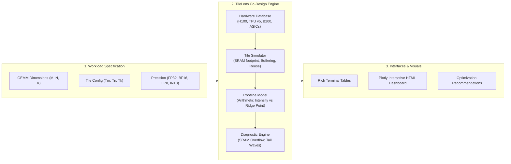

# 🔍 TileLens

<div align="center">

**AI Accelerator Hardware-Software Co-Design & Roofline Memory Tile Visualizer**

[](https://www.python.org/)
[](https://opensource.org/licenses/MIT)
[](#supported-hardware)
[](CONTRIBUTING.md)

</div>

---

## 💡 What is TileLens?

The semiconductor industry is currently hitting the **"Memory Wall"**: compute capability on modern AI accelerators (GPUs & TPUs) is growing much faster than off-chip memory bandwidth (HBM / DRAM). 

**TileLens** is an open-source hardware-software co-design toolkit designed to help semiconductor architects, ML compiler engineers, and researchers analyze and visualize how matrix computation **Tiles** travel across physical memory hierarchies:

$$\text{Off-Chip HBM / VRAM} \;\longleftrightarrow\; \text{On-Chip SRAM / Shared Memory} \;\longleftrightarrow\; \text{Systolic Array / Tensor Cores}$$

With **TileLens**, you can:
* ⚡ **Model the Roofline Bound:** Instantly discover whether an AI workload (LLMs, Attention, GEMM) is **Compute-Bound** or **Memory-Bandwidth Bound**.
* 🧱 **Simulate Tile Memory Flow:** Track SRAM allocation per core/SM, multi-buffering pipeline stages, and HBM data reload amplification factors.
* 🔍 **Head-to-Head Architecture Comparisons:** Compare how identical matrix tiles perform across **NVIDIA H100/A100/B200**, **Google TPU v4/v5e/v5p**, and custom **SkyWater 130nm ASICs**.
* 📊 **Export Interactive Visual Dashboards:** Generate standalone HTML dashboards featuring interactive Plotly roofline charts, memory hierarchy diagrams, and diagnostic alerts.

---

## 🏛️ System Architecture



---

## ⚡ Supported Hardware Profiles

| Device | Vendor | Architecture | Memory Bandwidth | SRAM / Core | Peak BF16 Compute | Peak FP8 Compute |
| :--- | :--- | :--- | :---: | :---: | :---: | :---: |
| **NVIDIA B200** | NVIDIA | Blackwell | 8,000 GB/s HBM3e | 256 KB / SM | 2,250 TFLOPs | 4,500 TFLOPs |
| **NVIDIA H100 SXM** | NVIDIA | Hopper | 3,350 GB/s HBM3 | 228 KB / SM | 989 TFLOPs | 1,978 TFLOPs |
| **NVIDIA A100 SXM** | NVIDIA | Ampere | 2,039 GB/s HBM2e | 164 KB / SM | 312 TFLOPs | — |
| **NVIDIA RTX 4090** | NVIDIA | Ada Lovelace | 1,008 GB/s GDDR6X | 128 KB / SM | 330 TFLOPs | 660 TFLOPs |
| **Google TPU v5p** | Google | TPU v5p | 1,600 GB/s HBM3 | 32 MB / Core | 459 TFLOPs | 918 TFLOPs |
| **Google TPU v5e** | Google | ViperLite | 819 GB/s HBM2e | 16 MB / Core | 197 TFLOPs | 394 TOPs |
| **Google TPU v4** | Google | Systolic Array | 1,200 GB/s HBM2 | 16 MB / Core | 275 TFLOPs | — |
| **OpenTPU-130** | Open Silicon | SkyWater 130nm | 800 MB/s HyperRAM | 64 KB OpenRAM | 51.2 GOPs (INT8) | — |

---

## 🚀 Quickstart

### 1. Installation

```bash
# Clone repository
git clone https://github.com/your-username/tilelens.git
cd tilelens

# Install in development mode
pip install -e .
```

### 2. Command-Line Interface (CLI)

#### List All Hardware Profiles:
```bash
tilelens list-hardware
```

#### Analyze a Matrix Multiplication (GEMM) Kernel:
```bash
tilelens gemm -M 4096 -N 4096 -K 4096 --device h100 --precision bf16 --tile-m 128 --tile-n 128 --tile-k 64
```

#### Compare GPU vs. TPU Performance:
```bash
tilelens compare -M 4096 -N 4096 -K 4096 --devices h100,tpu_v5e,tpu_v5p,a100 --precision bf16
```

#### Export an Interactive HTML Dashboard:
```bash
tilelens export-viz -M 4096 -N 4096 -K 4096 --devices h100,tpu_v5e,tpu_v5p,b200 -o dashboard.html
```

---

## 🐍 Python API Usage

You can embed TileLens directly into your kernel compiler or PyTorch/Triton scripts:

```python
from tilelens import get_hardware, Precision, PerformanceAnalyzer, TileConfig

# 1. Select target hardware
hw = get_hardware("nvidia_h100_sxm")

# 2. Configure tile geometry (e.g. 128x128x64 with 2 pipeline stages)
tile_cfg = TileConfig(
    tile_m=128,
    tile_n=128,
    tile_k=64,
    pipeline_stages=2,
    precision=Precision.BF16
)

# 3. Run co-design analysis for GEMM (M=4096, N=4096, K=4096)
analyzer = PerformanceAnalyzer(hw)
report = analyzer.analyze_gemm(4096, 4096, 4096, tile_cfg)

# 4. Print actionable diagnostics
print(report.summary())
```

---

## 🔬 Core Semiconductor Concepts

### 1. Arithmetic Intensity & The Ridge Point
The **Roofline Model** defines attainable throughput based on memory traffic:
$$\text{Operational Intensity} = \frac{\text{Total Operations (FLOPs)}}{\text{Total Memory Traffic (Bytes)}}$$

The **Hardware Ridge Point** is the threshold where a chip transitions from memory-bound to compute-bound:
$$\text{Ridge Point} = \frac{\text{Peak Compute Throughput (TFLOPs)}}{\text{Peak Memory Bandwidth (TB/s)}}$$

* **If Operational Intensity < Ridge Point:** The Tensor Cores / Systolic Arrays stall waiting for memory transfers (**Memory-Bound**).
* **If Operational Intensity ≥ Ridge Point:** Memory bandwidth is sufficient to saturate all compute units (**Compute-Bound**).

### 2. Tile Data Reuse Amplification
When large matrices are decomposed into tiles $(T_M, T_N, T_K)$, on-chip SRAM allows data reuse:
* Matrix $A$ tiles are reused across $N / T_N$ column blocks.
* Matrix $B$ tiles are reused across $M / T_M$ row blocks.

Increasing tile dimensions raises operational intensity, pushing kernels into the compute-bound zone until limited by **physical SRAM capacity per core**.

---

## 🤝 Contributing

We welcome contributions from the semiconductor, hardware architecture, and deep learning compiler communities!
* Add new hardware specifications (AMD Instinct MI300X, Tenstorrent Wormhole, Groq LPU).
* Add attention kernel modeling (FlashAttention-2/3, Ring Attention).
* Improve Triton and JAX Pallas trace ingestion.

See [CONTRIBUTING.md](CONTRIBUTING.md) for details.

---

## 📄 License
This project is licensed under the [MIT License](LICENSE).
