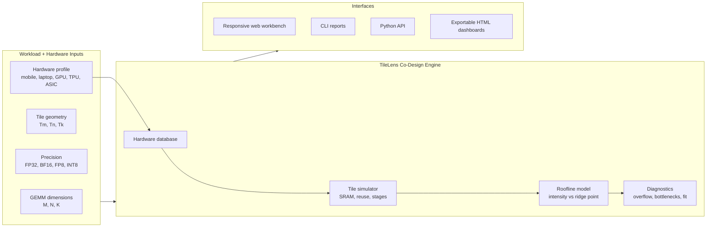

# TileLens

**Silicon workbench for chip blueprints, roofline analysis, tile-memory flow, and AI accelerator co-design.**

[](https://www.python.org/)
[](https://opensource.org/licenses/MIT)
[](#supported-hardware)
[](https://tile-lens.vercel.app/)

TileLens helps hardware architects, compiler engineers, and AI systems researchers inspect modern processors as full systems: die floorplans, memory hierarchy, compute ceilings, model-fit limits, tile reuse, and custom accelerator tradeoffs.

Open the live app: **https://tile-lens.vercel.app/**

## Highlights

- **Silicon Workbench UI:** redesigned responsive web app with chip search, vendor filters, compact dashboard navigation, and mobile-friendly controls.
- **3D Blueprint Inspector:** explore physical package views, 2D floorplans, silicon block grids, and block-level role/spec inspection.
- **LLM Capability Matrix:** estimate model fit, memory pressure, throughput, and time-to-first-token behavior across supported chips.
- **Roofline Analyzer:** compare operational intensity against each chip's ridge point to see whether a workload is memory-bound or compute-bound.
- **Tile Memory Flow:** simulate GEMM tiling, SRAM usage, reload amplification, pipeline stages, and systolic wavefront behavior.
- **Multi-Chip Compare:** compare mobile SoCs, laptop processors, desktop GPUs, datacenter accelerators, TPUs, and open ASIC profiles.
- **Custom Chip Architect:** enter ASIC/NPU specs and synthesize a custom profile for blueprint and roofline exploration.
- **Python + CLI Toolkit:** use the same modeling engine from scripts, terminals, examples, and generated dashboards.

## System Model



## Supported Hardware

TileLens includes profiles for mobile, laptop, workstation, cloud, and open-silicon targets.

| Device | Vendor | Class | Memory Bandwidth | On-Chip Memory | Peak BF16 / FP16 | AI / NPU Peak |
| :--- | :--- | :--- | ---: | ---: | ---: | ---: |
| Apple A17 Pro | Apple | Mobile | 51.2 GB/s | 24 MB SLC | 4.3 TFLOPs | 35 TOPS |
| Snapdragon 8 Gen 3 | Qualcomm | Mobile | 77 GB/s | 12 MB SLC | 6.8 TFLOPs | 45 TOPS |
| Google Tensor G4 | Google | Mobile | 68 GB/s | 8 MB SLC | 3.6 TFLOPs | 37 TOPS |
| Dimensity 9300 | MediaTek | Mobile | 96 GB/s | 10 MB SLC | 9.2 TFLOPs | 46 TOPS |
| Apple M4 | Apple | Laptop / Tablet | 120 GB/s | 32 MB SLC | 8.6 TFLOPs | 38 TOPS |
| Apple M3 Max | Apple | Workstation Laptop | 400 GB/s | 64 MB SLC | 32.4 TFLOPs | 18 TOPS |
| Intel Core Ultra 7 288V | Intel | AI Laptop | 137 GB/s | 16 MB MSC | 16.8 TFLOPs | 48 TOPS |
| AMD Ryzen AI 9 HX 370 | AMD | AI Laptop | 120 GB/s | 24 MB L3 | 15.6 TFLOPs | 50 TOPS |
| GeForce RTX 4060 Laptop | NVIDIA | Laptop GPU | 256 GB/s | 32 MB L2 | 60.5 TFLOPs | 121 TOPS FP8 |
| GeForce RTX 4090 | NVIDIA | Desktop GPU | 1,008 GB/s | 72 MB L2 | 330 TFLOPs | 660 TOPS FP8 |
| NVIDIA H100 SXM5 | NVIDIA | Datacenter GPU | 3,350 GB/s | 50 MB L2 | 989 TFLOPs | 1,978 TOPS FP8 |
| NVIDIA Blackwell B200 | NVIDIA | Datacenter GPU | 8,000 GB/s | 128 MB L2 | 2,250 TFLOPs | 4,500 TOPS FP8 |
| AMD Instinct MI300X | AMD | Datacenter GPU | 5,300 GB/s | 256 MB cache | 1,307 TFLOPs | 2,614 TOPS FP8 |
| Google TPU v5p | Google | Cloud TPU | 1,600 GB/s | 64 MB VMEM | 459 TFLOPs | 918 TOPS FP8 |
| Google TPU v5e | Google | Cloud TPU | 819 GB/s | 16 MB VMEM | 197 TFLOPs | 394 TOPS INT8 |
| OpenTPU-130 | Open Silicon | SkyWater 130nm ASIC | 800 MB/s | 64 KB OpenRAM | 51.2 GOPs INT8 | Edge ASIC |

## Quickstart

### Run the Web Workbench

The app is a standalone `index.html`, so it can run directly in a browser. For local API-compatible serving and mobile testing on the same network:

```bash
git clone https://github.com/preetham-s7/TileLens.git
cd TileLens
python -m http.server 8080
```

Then open:

- Desktop: `http://127.0.0.1:8080/`
- Phone on same Wi-Fi: `http://<your-local-ip>:8080/`

You can also install the package and use the CLI server:

```bash
pip install -e .
tilelens serve --port 8080
```

### Use the CLI

```bash
# List supported chips
tilelens list-hardware

# Inspect a mobile, laptop, or datacenter chip
tilelens blueprint -d a17
tilelens blueprint -d m4
tilelens blueprint -d h100

# Analyze GEMM tiling on a target device
tilelens gemm -M 4096 -N 4096 -K 4096 --device h100 --precision bf16 --tile-m 128 --tile-n 128 --tile-k 64

# Compare devices on the same workload
tilelens compare -M 4096 -N 4096 -K 4096 --devices a17,m4,rtx4060,h100 --precision bf16

# Export an interactive dashboard
tilelens export-viz --device h100 --output dashboard.html
```

## Python API

```python
from tilelens import Precision, PerformanceAnalyzer, TileConfig, get_hardware

hardware = get_hardware("nvidia_h100_sxm")

tile_config = TileConfig(
    tile_m=128,
    tile_n=128,
    tile_k=64,
    pipeline_stages=2,
    precision=Precision.BF16,
)

report = PerformanceAnalyzer(hardware).analyze_gemm(
    4096,
    4096,
    4096,
    tile_config,
)

print(report.summary())
```

## Core Concepts

### Roofline Ridge Point

The roofline model compares useful compute against memory traffic:

```text
Operational intensity = FLOPs / bytes moved
Ridge point = peak compute / peak memory bandwidth
```

- Below the ridge point, the workload is memory-bandwidth bound.
- Above the ridge point, the workload can approach compute saturation.

### Tile Reuse and SRAM Pressure

Large matrix operations are split into tiles. Larger tiles can improve data reuse and operational intensity, but only if the working set fits in on-chip SRAM or shared memory. TileLens estimates:

- input and accumulator SRAM footprint
- pipeline-stage buffering cost
- reload amplification from off-chip memory
- attainable throughput under the selected precision
- practical bottlenecks and optimization hints

## Project Layout

```text
TileLens/
├── index.html              # Responsive silicon workbench UI
├── api/index.py            # Vercel API endpoint
├── tilelens/
│   ├── core/               # Roofline, tile simulation, validation, analysis
│   ├── hardware/           # Hardware profiles and lookup aliases
│   ├── cli/                # Command-line interface
│   └── viz/                # Dashboard export helpers
├── tests/                  # Python and dashboard regression tests
├── examples/               # Example analyses
├── vercel.json             # Vercel deployment config
└── pyproject.toml
```

## Development Checks

```bash
python -m unittest discover -v
node tests/test_dashboard.cjs
git diff --check
```

## Deployment

The production site is deployed on Vercel:

```text
https://tile-lens.vercel.app/
```

The current repository includes `vercel.json` and `api/index.py` for Vercel hosting.

## Contributing

Contributions are welcome from hardware architecture, compiler, and ML systems communities. Good areas to extend:

- new hardware profiles
- attention kernel models
- Triton, JAX Pallas, or profiler trace ingestion
- more packaging/floorplan visualizations
- validation cases for mobile and datacenter chips

See [CONTRIBUTING.md](CONTRIBUTING.md) for details.

## License

TileLens is released under the [MIT License](LICENSE).
