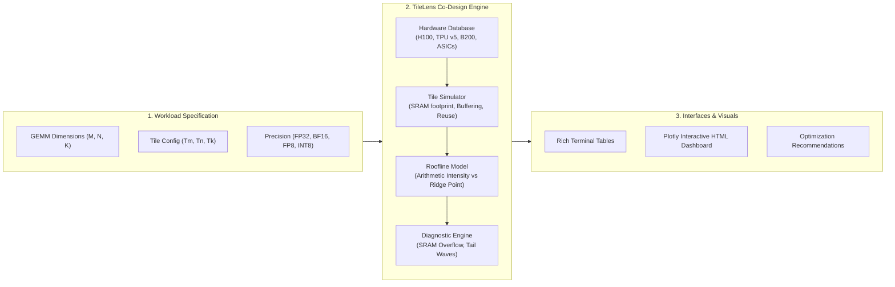

# 🔍 TileLens

<div align="center">

**AI Accelerator Hardware-Software Co-Design & Roofline Memory Tile Visualizer**

[](https://www.python.org/)
[](https://opensource.org/licenses/MIT)
[](#supported-hardware)
[](CONTRIBUTING.md)

</div>

---

## 💡 What is TileLens?

The semiconductor industry is currently hitting the **"Memory Wall"**: compute capability on modern AI accelerators (GPUs & TPUs) is growing much faster than off-chip memory bandwidth (HBM / DRAM). 

**TileLens** is an open-source hardware-software co-design toolkit designed to help semiconductor architects, ML compiler engineers, and researchers analyze and visualize how matrix computation **Tiles** travel across physical memory hierarchies:

$$\text{Off-Chip HBM / VRAM} \;\longleftrightarrow\; \text{On-Chip SRAM / Shared Memory} \;\longleftrightarrow\; \text{Systolic Array / Tensor Cores}$$

With **TileLens**, you can:
* ⚡ **Model the Roofline Bound:** Instantly discover whether an AI workload (LLMs, Attention, GEMM) is **Compute-Bound** or **Memory-Bandwidth Bound**.
* 🧱 **Simulate Tile Memory Flow:** Track SRAM allocation per core/SM, multi-buffering pipeline stages, and HBM data reload amplification factors.
* 🔍 **Head-to-Head Architecture Comparisons:** Compare how identical matrix tiles perform across **NVIDIA H100/A100/B200**, **Google TPU v4/v5e/v5p**, and custom **SkyWater 130nm ASICs**.
* 📊 **Export Interactive Visual Dashboards:** Generate standalone HTML dashboards featuring interactive Plotly roofline charts, memory hierarchy diagrams, and diagnostic alerts.

---

## 🏛️ System Architecture



---

## ⚡ Supported Hardware Profiles (Mobile, Laptop PCs & Cloud AI)

| Device | Vendor | Target / Class | Memory Bandwidth | SRAM / Cache | Peak BF16 Compute | NPU Throughput |
| :--- | :--- | :--- | :---: | :---: | :---: | :---: |
| **Apple A17 Pro** | Apple | Mobile (iPhone 15 Pro) | 51.2 GB/s LPDDR5X | 24 MB SLC | 4.3 TFLOPs | 35 TOPS (ANE) |
| **Snapdragon 8 Gen 3** | Qualcomm | Flagship Mobile | 77.0 GB/s LPDDR5X | 12 MB SLC | 6.8 TFLOPs | 45 TOPS (Hexagon) |
| **Google Tensor G4** | Google | Mobile (Pixel 9 Pro) | 68.0 GB/s LPDDR5X | 8 MB SLC | 3.6 TFLOPs | 37 TOPS (EdgeTPU) |
| **Dimensity 9300** | MediaTek | Flagship Mobile | 96.0 GB/s LPDDR5T | 10 MB SLC | 9.2 TFLOPs | 46 TOPS (APU 790) |
| **Apple M4** | Apple | Laptop / iPad Pro | 120.0 GB/s Unified | 32 MB SLC | 8.6 TFLOPs | 38 TOPS (ANE) |
| **Apple M3 Max** | Apple | Workstation Laptop | 400.0 GB/s Unified | 64 MB SLC | 32.4 TFLOPs | 18 TOPS |
| **Core Ultra 7 288V** | Intel | Copilot+ Thin Laptop | 137.0 GB/s On-Package | 16 MB MSC | 16.8 TFLOPs | 48 TOPS (NPU 4) |
| **Ryzen AI 9 HX 370**| AMD | AI Laptop PC | 120.0 GB/s LPDDR5X | 24 MB L3 | 15.6 TFLOPs | 50 TOPS (XDNA 2) |
| **GeForce RTX 4060** | NVIDIA | Gaming/AI Laptop | 256.0 GB/s GDDR6 | 32 MB L2 | 60.5 TFLOPs | 121 TOPS FP8 |
| **GeForce RTX 4090** | NVIDIA | Desktop Workstation | 1,008 GB/s GDDR6X | 72 MB L2 | 330 TFLOPs | 660 TOPS FP8 |
| **NVIDIA B200** | NVIDIA | Hyperscale Dual-Die | 8,000 GB/s HBM3e | 128 MB L2 | 2,250 TFLOPs | 4,500 TOPS FP8 |
| **NVIDIA H100 SXM** | NVIDIA | Cloud Datacenter | 3,350 GB/s HBM3 | 50 MB L2 | 989 TFLOPs | 1,978 TOPS FP8 |
| **NVIDIA A100 SXM** | NVIDIA | Cloud Datacenter | 2,039 GB/s HBM2e | 40 MB L2 | 312 TFLOPs | — |
| **AMD Instinct MI300X**| AMD | Hyperscale Cloud | 5,300 GB/s HBM3 | 256 MB Cache | 1,307 TFLOPs | 2,614 TOPS FP8 |
| **Google TPU v5p** | Google | TPU v5p Pod | 1,600 GB/s HBM3 | 64 MB VMEM | 459 TFLOPs | 918 TOPS FP8 |
| **Google TPU v5e** | Google | TPU v5e Pod | 819 GB/s HBM2e | 16 MB VMEM | 197 TFLOPs | 394 TOPS INT8 |
| **Google TPU v4** | Google | Systolic Array | 1,200 GB/s HBM2 | 32 MB VMEM | 275 TFLOPs | — |
| **OpenTPU-130** | Open Silicon | SkyWater 130nm ASIC | 800 MB/s HyperRAM | 64 KB OpenRAM | 51.2 GOPs (INT8) | — |

---

## 🚀 Quickstart

### 1. Installation

```bash
# Clone repository
git clone https://github.com/preetham-s7/TileLens.git
cd TileLens

# Install in development mode
pip install -e .
```

### 2. Universal Web Application (Runs on Any Mobile Phone, Tablet & Laptop PC)

Start the local server so your laptop and any phone on the same Wi-Fi can view the blueprints and operational capabilities:

```bash
tilelens serve --port 8080
```
* **Laptop / PC Browser:** Open `http://localhost:8080/index.html` (or double-click `index.html` directly).
* **Mobile Phones (iPhone / Android):** Open `http://<your-local-ip>:8080/index.html` to auto-detect your phone's chip and view its silicon blueprint!

### 3. Command-Line Interface (CLI)

#### Inspect a Chip's Blueprint & What Else It Does:
```bash
# Mobile chip (Apple A17 Pro)
tilelens blueprint -d a17

# Laptop processor (Apple M4 or Intel Lunar Lake)
tilelens blueprint -d m4
tilelens blueprint -d lunarlake

# Datacenter GPU
tilelens blueprint -d h100
```

#### List All Hardware Profiles:
```bash
tilelens list-hardware
```

#### Analyze a Matrix Multiplication (GEMM) Kernel:
```bash
tilelens gemm -M 4096 -N 4096 -K 4096 --device h100 --precision bf16 --tile-m 128 --tile-n 128 --tile-k 64
```

#### Compare Mobile vs Laptop vs Datacenter Performance:
```bash
tilelens compare -M 4096 -N 4096 -K 4096 --devices a17,m4,rtx4060,h100 --precision bf16
```

---

## 🐍 Python API Usage

You can embed TileLens directly into your kernel compiler or PyTorch/Triton scripts:

```python
from tilelens import get_hardware, Precision, PerformanceAnalyzer, TileConfig

# 1. Select target hardware
hw = get_hardware("nvidia_h100_sxm")

# 2. Configure tile geometry (e.g. 128x128x64 with 2 pipeline stages)
tile_cfg = TileConfig(
    tile_m=128,
    tile_n=128,
    tile_k=64,
    pipeline_stages=2,
    precision=Precision.BF16
)

# 3. Run co-design analysis for GEMM (M=4096, N=4096, K=4096)
analyzer = PerformanceAnalyzer(hw)
report = analyzer.analyze_gemm(4096, 4096, 4096, tile_cfg)

# 4. Print actionable diagnostics
print(report.summary())
```

---

## 🔬 Core Semiconductor Concepts

### 1. Arithmetic Intensity & The Ridge Point
The **Roofline Model** defines attainable throughput based on memory traffic:
$$\text{Operational Intensity} = \frac{\text{Total Operations (FLOPs)}}{\text{Total Memory Traffic (Bytes)}}$$

The **Hardware Ridge Point** is the threshold where a chip transitions from memory-bound to compute-bound:
$$\text{Ridge Point} = \frac{\text{Peak Compute Throughput (TFLOPs)}}{\text{Peak Memory Bandwidth (TB/s)}}$$

* **If Operational Intensity < Ridge Point:** The Tensor Cores / Systolic Arrays stall waiting for memory transfers (**Memory-Bound**).
* **If Operational Intensity ≥ Ridge Point:** Memory bandwidth is sufficient to saturate all compute units (**Compute-Bound**).

### 2. Tile Data Reuse Amplification
When large matrices are decomposed into tiles $(T_M, T_N, T_K)$, on-chip SRAM allows data reuse:
* Matrix $A$ tiles are reused across $N / T_N$ column blocks.
* Matrix $B$ tiles are reused across $M / T_M$ row blocks.

Increasing tile dimensions raises operational intensity, pushing kernels into the compute-bound zone until limited by **physical SRAM capacity per core**.

---

## 🤝 Contributing

We welcome contributions from the semiconductor, hardware architecture, and deep learning compiler communities!
* Add new hardware specifications (AMD Instinct MI300X, Tenstorrent Wormhole, Groq LPU).
* Add attention kernel modeling (FlashAttention-2/3, Ring Attention).
* Improve Triton and JAX Pallas trace ingestion.

See [CONTRIBUTING.md](CONTRIBUTING.md) for details.

---

## 📄 License
This project is licensed under the [MIT License](LICENSE).
